# Test sur de l'UI
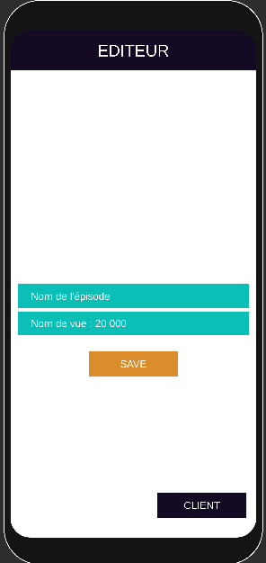 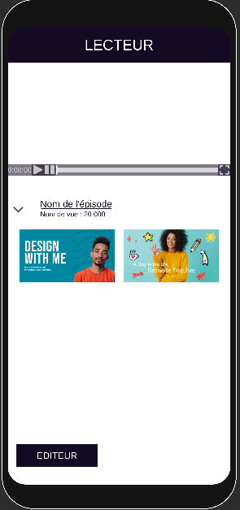 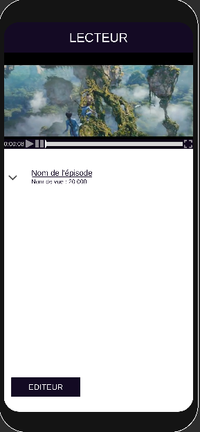
 
 
## Prérequis
 
- Le projet est sur la version 2020.3.29f1 d'Unity.
 
- La scène à lancer et la scène par défaut.
 
- La build du projet se trouve dans le dossier Build.
 
## Features disponible
 
### Scroll
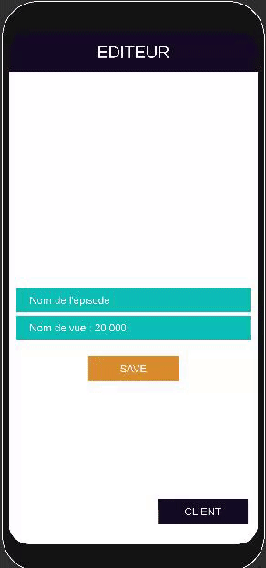
 
On peux swipe d'une page à l'autre et on peut aussi se servir des boutons Client et Éditeur pour swipe d'une page à l'autre.
 
### Lecteur vidéo
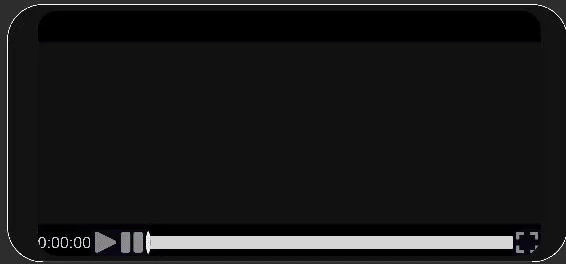
 
On peut lire une vidéo, la mettre en pause, changer le timecode et la mettre en plein écran.
 
 
### Textfield
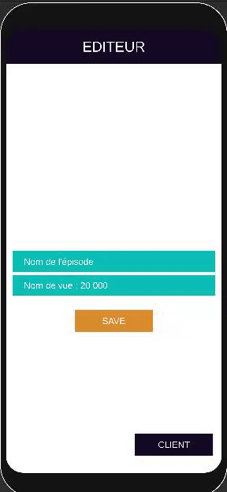
 
On peux modifier le nombre de vue et le nom de l'épisode depuis l'éditeur.
 
### Dropdown
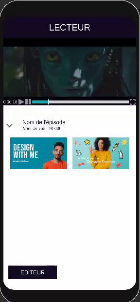
 
Le dropdown permet de cacher/révéler les miniatures.
 
## Features manquantes
 
- Le mode horizontal n'est pas pris en compte.
 
- Il n'y a pas le bouton PLAYTOGETHER pour le lecteur.
 
- Il n'y a pas d'animation de fade in fade out pour la barre du lecteur et pour le dropdown.
 
## Bugs / Problèmes rencontré
 
- Pour l'écran de l'éditeur je n'ai pas de soucis de proportion pour le mode portrait, mais je n'ai pas trouvé de solution pour faire en sorte que l'écran du menu du lecteur soit proportionnel à la taille de la fenêtre sans que ça décale toute l'UI.
 
- De temps en temps il y a un décalage de l'écran lors du swipe (avec ou sans les boutons).
 
 
## Architecture et organisation
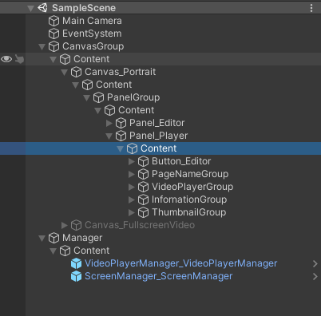
 
Pour l'organisation de la scène et du canvas, j'ai essayer de reproduire au mieux la nomenclature du document en pièce jointe du premier email.
 
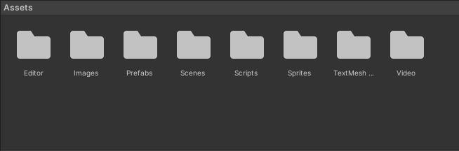
 
Pour l'organisation des fichiers, j'ai rangé par catégorie de fichier, la seule exception c'est dans le fichier Vidéo ou se trouve aussi un RawImage qui sert de texture d'affichage pour la vidéo.
 
Côté script, c'est le script ScreenManager qui se charge d'activer/désactiver les bon canvas et c'est le script VideoPlayerManager qui gère les actions play, pause, fullscreen, changer le timecode actuel...
 
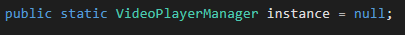
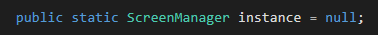
 
Pour éviter de me retrouver à devoir avoir des pointeurs sur les managers trop loin dans la hiérarchie des éléments, je créer un pointeur static dans la classe pour que tout les autres scripts puissent y avoir accès.
 
Les autres scripts sont des scripts indépendants qui sont là pour exécuter une tâche précise. (ex: Dropdown, PageSwiper,...)

Mes tests on été effectué sur mon Samsung Galaxy S8.
 
## Temps Requis
 
Au total, environ ~12h30.
 
Au début du projet j'ai essentiellement setup Unity remote et device simulator, j'ai aussi joué un peu avec TextMeshPro pour le découvrir, ça à durée environs 1h30.
 
Environ 6h30 pour le lecteur (Lire la vidéo, la barre, fullscreen...).
 
Estimer que le temps pour reproduire l'UI est compliqué, parce qu'il a beaucoup changé en cours de route, mais je pense que ça m'a pris environ 1h30.
 
Le Swipe de page m'a pris environ 1h00. il y a clairement des améliorations à faire.
 
Le dropdown sans animation à dû me prendre 10~15min.
 
Essayer de trouver un moyen pour que le panel du lecteur conserve les bonnes proportions m'a au moins pris 2h00. (Malheureusement j'ai pas trouvé de solution.)